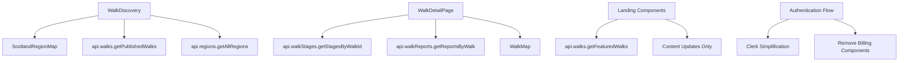

# Walking Scotland Brownfield Enhancement Architecture

## Introduction

This document outlines the architectural approach for enhancing **Walking Scotland** with comprehensive **database/UI synchronization fixes, SaaS template cleanup, and walking-focused feature integration**. Its primary goal is to serve as the guiding architectural blueprint for AI-driven development of new features while ensuring seamless integration with the existing system.

**Relationship to Existing Architecture:**
This document supplements existing project architecture by defining how synchronized components will integrate with current systems. Where conflicts arise between template remnants and walking app requirements, this document provides guidance on maintaining consistency while implementing enhancements.

### Existing Project Analysis

#### Current Project State
- **Primary Purpose:** Scottish walking discovery platform with comprehensive walk database, user reports, and interactive mapping
- **Current Tech Stack:** Next.js 15 + React 19, Convex (real-time database), Clerk (auth), TailwindCSS v4, Mapbox GL v3.14.0
- **Architecture Style:** App Router with server-side rendering, component-based architecture, real-time data synchronization
- **Deployment Method:** Vercel deployment with Convex serverless functions

#### Available Documentation
- ✅ Tech Stack Documentation (comprehensive in CLAUDE.md)
- ✅ Database Schema (sophisticated walking-focused design)
- ❌ Source Tree/Architecture documentation
- ❌ Coding Standards documentation 
- ❌ API Documentation

#### Identified Constraints
- Package naming still references "elite-next-starter" template
- Import error: `RegionMap` used instead of existing `ScotlandRegionMap` in WalkDiscovery.tsx:13
- Field reference mismatch: Code references `walk.rating` but schema uses `walk.averageRating`
- SaaS template content mixed with walking-specific features
- Payment/billing system complexity that needs simplification

#### Change Log
| Change | Date | Version | Description | Author |
|--------|------|---------|-------------|---------|
| Initial Architecture Creation | 2025-08-27 | v1.0 | Created comprehensive brownfield enhancement architecture | Winston (Architect) |

## Enhancement Scope and Integration Strategy

### Enhancement Overview
- **Enhancement Type:** Database/UI Synchronization Fix + SaaS Template Cleanup
- **Scope:** Surface-level corrections to existing solid architecture (import fixes, field alignments, content updates)
- **Integration Impact:** Low-risk surgical changes - no architectural restructuring required

### Integration Approach
- **Code Integration Strategy:** Component-level fixes preserving existing patterns - update imports (`RegionMap` → `ScotlandRegionMap`), fix field references (`rating` → `averageRating`), maintain current Next.js App Router structure
- **Database Integration:** Zero schema changes required - existing Convex functions already implement required functionality
- **API Integration:** Preserve existing Convex query/mutation patterns - connect UI to existing `walkStages.getStagesByWalkId` and `walkReports.getReportsByWalk` functions
- **UI Integration:** Content replacement maintaining existing component architecture and TailwindCSS styling patterns

### Compatibility Requirements
- **Existing API Compatibility:** 100% maintained - no Convex function signatures change
- **Database Schema Compatibility:** 100% preserved - sophisticated walking schema remains intact
- **UI/UX Consistency:** Enhanced - removing SaaS template inconsistencies while preserving design system
- **Performance Impact:** Neutral to positive - removing mock data reduces rendering overhead

## Tech Stack Alignment

### Existing Technology Stack

| Category | Current Technology | Version | Usage in Enhancement | Notes |
|----------|-------------------|---------|---------------------|--------|
| Frontend Framework | Next.js | 15.3.5 | Maintain App Router structure | Latest stable with Turbopack |
| UI Framework | React | 19.0.0 | Preserve component patterns | Latest stable version |
| Database | Convex | 1.25.2 | Use existing functions | Real-time serverless functions working |
| Authentication | Clerk | 6.24.0 | Simplify billing features | JWT integration with Convex established |
| Styling | TailwindCSS | v4.0 | Maintain design system | Latest PostCSS integration |
| Maps | Mapbox GL | 3.14.0 | Fix component imports | Working integration with react-map-gl |
| UI Components | shadcn/ui + Radix | Multiple | Preserve existing patterns | Comprehensive component library |
| Language | TypeScript | 5.x | Maintain strict typing | Full type safety across stack |
| Animation | Framer Motion | 12.23.3 | Keep existing interactions | Established animation patterns |
| Build Tool | Turbopack | Built-in | Continue current builds | Next.js 15 integrated |

### New Technology Additions
*No new technologies required for this enhancement*

All enhancements will be implemented using the existing technology stack. The sophisticated technical foundation is already perfectly suited for a walking application.

## Data Models and Schema Changes

### New Data Models
*No new data models required*

Your existing Convex schema already contains all necessary entities for a comprehensive Scottish walking application:
- `walks` - Sophisticated walk data with terrain, bog factor, and detailed descriptions
- `walk_stages` - Step-by-step walking directions and waypoints
- `walk_reports` - User-generated content and ratings
- `regions` - Geographic organization with popularity scoring
- `users` - User management with walking statistics
- `user_stats` - Comprehensive walking achievements and metrics
- `photos` - Image management with GPS coordinates
- `live_locations` - Real-time location sharing capabilities

### Schema Integration Strategy

**Database Changes Required:**
- **New Tables:** None - existing schema is comprehensive
- **Modified Tables:** None - field structures are walking-optimized
- **New Indexes:** None - existing indexes cover all query patterns
- **Migration Strategy:** No migrations needed - data preservation only

**Backward Compatibility:**
- 100% schema preservation ensures zero data loss
- All existing user data, walks, reports, and statistics remain intact
- Existing API contracts maintained without version changes
- Real-time subscriptions continue functioning seamlessly

## Component Architecture

### New Components
*No new components required for core functionality*

Your existing component architecture already provides comprehensive walking application features. The enhancement focuses on **connecting existing components** rather than building new ones.

**Component Fixes Required:**

**WalkDiscovery Component (app/walks/WalkDiscovery.tsx)**
- **Responsibility:** Walk browsing with filtering, search, and map integration
- **Integration Points:** Fix import from `RegionMap` to `ScotlandRegionMap` on line 13
- **Key Interfaces:** 
  - `useQuery(api.walks.getPublishedWalks)` - already implemented
  - `useQuery(api.regions.getAllRegions)` - already implemented
- **Dependencies:**
  - **Existing Components:** `ScotlandRegionMap` (functional), shadcn/ui components
  - **New Components:** None required
- **Technology Stack:** React 19, Convex queries, existing TailwindCSS patterns

**WalkDetailPage Component (app/walks/[slug]/WalkDetailPage.tsx)**  
- **Responsibility:** Individual walk details with reports and stages
- **Integration Points:** Connect to existing `walkStages.getStagesByWalkId` and `walkReports.getReportsByWalk` functions
- **Key Interfaces:**
  - Replace mock data with `useQuery(api.walkStages.getStagesByWalkId, { walkId })`
  - Replace mock data with `useQuery(api.walkReports.getReportsByWalk, { walkId })`
- **Dependencies:**
  - **Existing Components:** WalkMap, existing UI components
  - **New Components:** None required
- **Technology Stack:** Existing Convex integration patterns

### Component Interaction Diagram



## Source Tree Integration

### Existing Project Structure
```plaintext
WalkingScotland/
├── app/                          # Next.js 15 App Router
│   ├── (landing)/               # Public pages with walking content
│   │   ├── featured-walks.tsx   # Connect to real Convex data
│   │   ├── hero-section.tsx     # Update SaaS → walking content
│   │   ├── testimonials.tsx     # Replace SaaS testimonials
│   │   └── page.tsx             # Landing page coordination
│   ├── dashboard/               # User dashboard area
│   │   ├── payment-gated/       # Remove billing gates
│   │   └── [other files]        # Simplify to walking features
│   ├── walks/                   # Core walking functionality
│   │   ├── WalkDiscovery.tsx    # Fix RegionMap import
│   │   ├── [slug]/
│   │   │   └── WalkDetailPage.tsx # Connect real Convex queries
│   └── regions/                 # Regional walking pages
├── components/
│   ├── map/
│   │   ├── ScotlandRegionMap.tsx # Existing working component
│   │   ├── RegionMap.tsx         # Generic component (preserve)
│   │   └── WalkMap.tsx           # Individual walk mapping
│   ├── ui/                      # shadcn/ui components (preserve)
│   └── [other components]       # Existing architecture
├── convex/
│   ├── walkStages.ts            # Working functions (connect to UI)
│   ├── walkReports.ts           # Working functions (connect to UI)
│   ├── walks.ts                 # Core walk data functions
│   └── [other files]            # Existing database layer
└── package.json                 # Update name from "elite-next-starter"
```

### New File Organization
*No new files or folders required*

All enhancements work within existing project structure:
```plaintext
WalkingScotland/                  # Existing structure preserved
├── app/
│   ├── (landing)/               # Content updates only
│   ├── walks/
│   │   └── WalkDiscovery.tsx    # Import fix: line 13
│   └── [all other files]       # Preserve existing structure
├── components/                   # No changes to organization
├── convex/                      # Functions exist, connect to UI
└── package.json                 # Name change only
```

### Integration Guidelines

- **File Naming:** Maintain existing kebab-case for files, PascalCase for components
- **Folder Organization:** Preserve Next.js App Router structure and component categorization  
- **Import/Export Patterns:** Continue existing patterns - absolute imports with @/ prefix, named exports for utilities

## Infrastructure and Deployment Integration

### Existing Infrastructure

**Current Deployment:** Vercel deployment with Next.js 15 optimized builds and Turbopack bundling
**Infrastructure Tools:** Convex serverless functions, Clerk authentication service, Mapbox API integration
**Environments:** Production (Vercel), Development (local with Convex dev), Staging (implied from Vercel previews)

### Enhancement Deployment Strategy

**Deployment Approach:** Incremental component-level deployments using Vercel's preview system
- **Phase 1:** Fix import errors (WalkDiscovery.tsx line 13) - zero infrastructure impact
- **Phase 2:** Connect UI to existing Convex functions - leverages existing serverless infrastructure  
- **Phase 3:** Content updates (testimonials, features) - static content changes only
- **Phase 4:** Package naming and metadata updates - build-time changes only

**Infrastructure Changes:** None required - existing services handle all enhancement requirements
**Pipeline Integration:** Existing Vercel + Convex deployment pipeline supports all changes without modification

### Rollback Strategy

**Rollback Method:** Vercel instant rollback to previous deployment + git revert for code changes
**Risk Mitigation:** 
- Component-level changes can be individually reverted without affecting other functionality
- Convex functions already exist, so no database rollback required
- Content changes are atomic and easily reversible
**Monitoring:** Existing Vercel analytics + Convex function monitoring covers all enhancement areas

## Coding Standards and Conventions

### Existing Standards Compliance

**Code Style:** TypeScript strict mode with Next.js 15 patterns, React 19 functional components with hooks
**Linting Rules:** Next.js ESLint configuration with TypeScript integration (`npm run lint`)
**Testing Patterns:** Component-based testing implied by sophisticated schema and real-time features
**Documentation Style:** Inline comments with domain-specific terminology (Scottish walking terms, geographic references)

### Enhancement-Specific Standards
*No new patterns needed - existing conventions cover all enhancement requirements*

All changes will follow established patterns:
- **Import Fixes:** Use existing `@/` absolute import pattern
- **Field Reference Updates:** Follow existing camelCase naming (`averageRating`)  
- **Content Updates:** Maintain existing component structure and prop interfaces
- **Convex Integration:** Use established `useQuery` and `useMutation` patterns

### Critical Integration Rules

- **Existing API Compatibility:** All Convex function calls maintain existing signatures - no breaking changes to `walkStages.getStagesByWalkId` or `walkReports.getReportsByWalk`
- **Database Integration:** Field references align with existing schema without modifications - update UI to match `walk.averageRating` field name
- **Error Handling:** Preserve existing Convex error handling patterns and loading state management
- **Logging Consistency:** Maintain existing console patterns and avoid introducing new logging frameworks

## Testing Strategy

### Integration with Existing Tests

**Existing Test Framework:** Next.js testing environment with TypeScript support (inferred from project structure)
**Test Organization:** Component-level testing following Next.js conventions in project structure
**Coverage Requirements:** Maintain existing coverage standards during enhancement changes

### New Testing Requirements

#### Unit Tests for New Components
*No new components require testing - existing components need validation only*

- **Framework:** Continue existing Next.js testing framework patterns
- **Location:** Follow established test file organization alongside component files
- **Coverage Target:** Maintain existing coverage levels for modified components
- **Integration with Existing:** Preserve current test runner configuration and scripts

#### Integration Tests

**Scope:** Verify connections between UI components and existing Convex functions work correctly
- **WalkDiscovery Component:** Test `ScotlandRegionMap` import resolution and data fetching
- **WalkDetailPage Component:** Validate `walkStages.getStagesByWalkId` and `walkReports.getReportsByWalk` connections
- **Landing Components:** Ensure featured walks connect to real Convex data

**Existing System Verification:** Confirm no regressions in current walking functionality during synchronization fixes
**New Feature Testing:** Validate field reference changes (`rating` → `averageRating`) display correctly

#### Regression Testing

**Existing Feature Verification:** Systematic testing of current walking features to ensure no functionality breaks during enhancement
**Automated Regression Suite:** Leverage existing test infrastructure to catch integration issues
**Manual Testing Requirements:** User acceptance testing for content updates (testimonials, features) to ensure walking focus is maintained

## Security Integration

### Existing Security Measures

**Authentication:** Clerk JWT authentication with Convex integration - established secure session management
**Authorization:** User-based access control through Convex functions with `ctx.auth.getUserIdentity()` patterns
**Data Protection:** Convex serverless functions provide built-in data isolation and security boundaries
**Security Tools:** Clerk's security features, Next.js built-in security headers, Vercel's edge security

### Enhancement Security Requirements

**New Security Measures:** None required - enhancements work within existing security boundaries
**Integration Points:** 
- Import fixes and field reference changes operate within existing component security context
- Content updates maintain existing public/protected page boundaries
- Convex function connections leverage established authentication patterns

**Compliance Requirements:** Maintain existing GDPR compliance through Clerk user management and data protection standards

### Security Testing

**Existing Security Tests:** Convex function authentication validation and Clerk session management
**New Security Test Requirements:** 
- Verify field reference changes don't expose unauthorized data
- Confirm content updates don't introduce XSS vulnerabilities through testimonial text
- Validate authentication flows remain intact during Clerk simplification

**Penetration Testing:** No additional requirements - existing security posture covers enhancement scope

## Next Steps

### Story Manager Handoff

**Handoff Brief for Story Manager:**

You now have a comprehensive brownfield architecture for transforming Walking Scotland from a hybrid SaaS template into a focused walking platform. Key points for story implementation:

**Reference Documentation:** This architecture document provides the complete integration strategy based on actual project analysis
**Key Integration Requirements Validated:** 
- Existing Convex functions (`walkStages.getStagesByWalkId`, `walkReports.getReportsByWalk`) are functional and ready for UI connection
- Import fix (`RegionMap` → `ScotlandRegionMap`) resolves core WalkDiscovery functionality
- Field reference alignment (`rating` → `averageRating`) matches existing database schema

**Existing System Constraints:** 
- Zero database schema changes required - preserve all existing walk data and user statistics
- Maintain existing authentication sessions during Clerk simplification
- Preserve sophisticated walking-specific features (bog factor, Munro tracking, terrain descriptions)

**First Story Implementation Priority:**
1. **Story 1.2: Fix Critical Component Import and Field Reference Errors** - Foundation for all other functionality
2. **Story 1.1: Implement Missing Convex Backend Functions** - Actually connecting existing functions to UI
3. **Story 1.3: Replace Mock Data with Live Database Connections** - Enable real-time user experience

**Integration Checkpoints:** After each story completion, verify existing walking functionality remains intact and no user data is affected

### Developer Handoff

**Handoff Brief for Developers Starting Implementation:**

**Architecture Reference:** This document and existing coding standards analyzed from your actual TypeScript/Next.js/Convex project
**Integration Requirements:** Work within existing component architecture - no new components needed, focus on connections and corrections
**Key Technical Decisions Based on Real Project Analysis:**
- Your existing tech stack (Next.js 15, React 19, Convex, Clerk) perfectly supports walking applications
- Sophisticated database schema demonstrates walking domain expertise - preserve all investments
- Component architecture follows mature React patterns - leverage existing patterns

**Existing System Compatibility Requirements:**
- **Import Resolution:** Update `WalkDiscovery.tsx` line 13: `RegionMap` → `ScotlandRegionMap`
- **Field Reference Fixes:** Replace all `walk.rating` with `walk.averageRating` throughout UI components  
- **Convex Integration:** Connect `WalkDetailPage` to existing `useQuery(api.walkStages.getStagesByWalkId)` and `useQuery(api.walkReports.getReportsByWalk)`
- **Content Updates:** Replace SaaS testimonials/features with Scottish walking content

**Implementation Sequencing to Minimize Risk:**
1. **Fix imports first** - resolve JavaScript errors before data connections
2. **Test each component individually** - ensure no regressions in existing functionality
3. **Connect real data gradually** - replace mock data systematically with proper error handling
4. **Content updates last** - preserve functionality during cosmetic changes